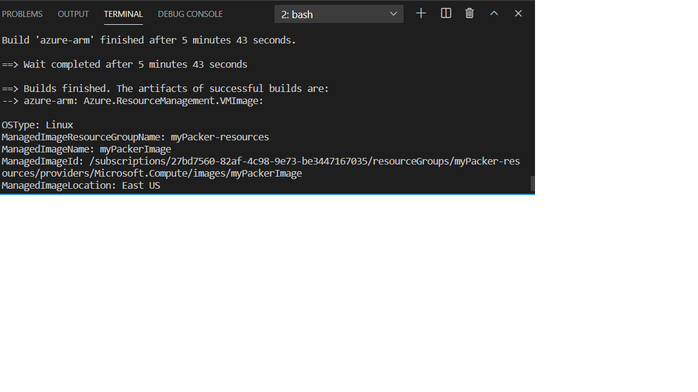
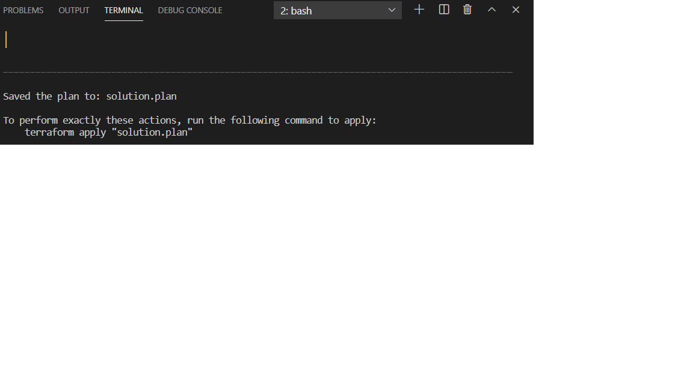
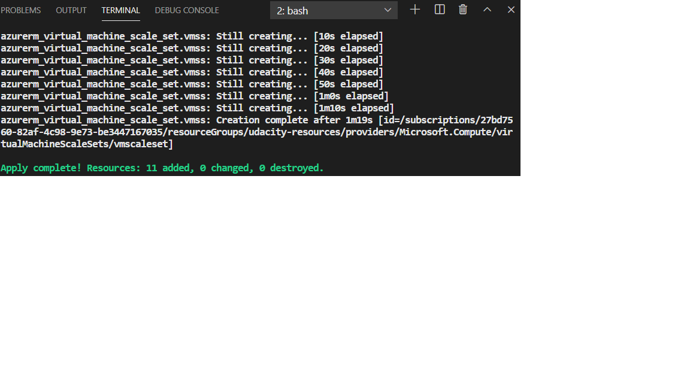
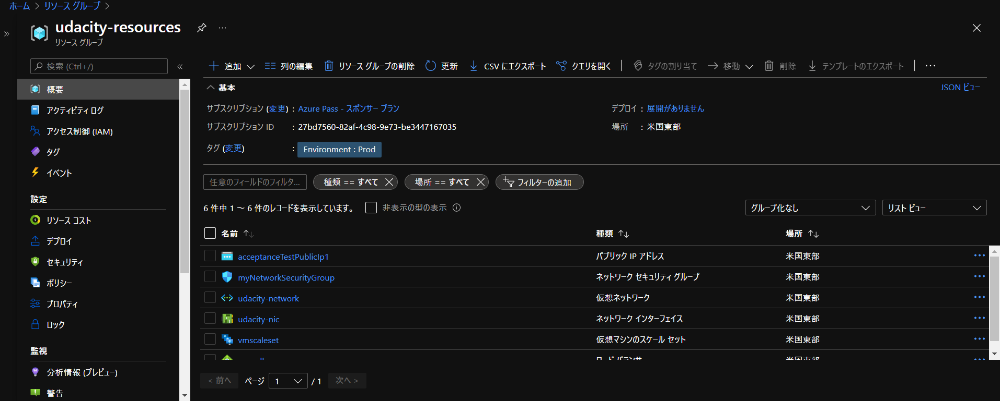

# Azure Infrastructure Operations Project: Deploying a scalable IaaS web server in Azure

### Introduction
For this project, you will write a Packer template and a Terraform template to deploy a customizable, scalable web server in Azure.

### Getting Started
1. Clone this repository

2. Create your infrastructure as code

3. Update this README to reflect how someone would use your code.

### Dependencies
1. Create an [Azure Account](https://portal.azure.com) 
2. Install the [Azure command line interface](https://docs.microsoft.com/en-us/cli/azure/install-azure-cli?view=azure-cli-latest)
3. Install [Packer](https://www.packer.io/downloads)
4. Install [Terraform](https://www.terraform.io/downloads.html)

## Instructions

Once you've collected above dependencies, you need to do following in order to deploy the web server: 

1. Deploy Azure Policy 
2. Deploy the packer image
3. Deploy the infrastructure with Terraform template

### Deploy Azure Policy

You need to define custom policy and then create assignment.
This could be done with Azure CLI or Portal.
Please refer to the MS Docs site for the detail.
https://docs.microsoft.com/ja-jp/azure/governance/policy/assign-policy-portal

Following is an example CLI command.
```bash
az policy definition create --name tagging-policy --display-name "tagging-policy" --description "all indexed resources in your subscription have tags and deny deployment if they do not." --rules ./policy.json --mode All
```

```bash
az policy assignment create --name 'tagging-policy-assignment' --display-name "tagging-policy assignment" --scope /subscriptions/27bd7560-82af-4c98-9e73-be3447167035 --policy /subscriptions/27bd7560-82af-4c98-9e73-be3447167035/providers/Microsoft.Authorization/policyDefinitions/tagging-policy
```


###  Deploy the Packer Image

Packer is a server templating software. It will deploy virtual machines images. After deploying the virtual machines with the help of packer template, you need to delete the packer images as it does not maintain the state.

####  Config Environment Variables

Go to the terminal and export the environment variables like below.

```bash
export ARM_CLIENT_ID=4685768f-1912-4c9a-8226-b670918xxxxfakeclientid
export ARM_CLIENT_SECRET=6GNB5c5p_5H.-odi_zffakesecret
export ARM_SUBSCRIPTION_ID=59ce2236-a139-4c5fakesubsribtionid
```

####  Get Subscription ID

* Login into your azure account with Azure CLI
```bash
az login
```

* show the subscription 
```bash
az account show --output table
```

Detail could be refererenced at Microsoft docs site:
https://docs.microsoft.com/ja-jp/cli/azure/manage-azure-subscriptions-azure-cli

####  Get Client ID

* Login into your azure account
* Search and click "Azure Active Directory"
* Click "App registrations" under the Manage tab
* Click the application that you own
* Copy the client ID

#### Get Client Secret

* Login into your azure account
* Search and click "Azure Active Directory"
* Click "App registrations" under the Manage tab
* Click the application that you own
* Click the "Certificates & Secrets" under the Manage tab
* Create a client secret as you need.


####  Deploy the Packer Image   

Run the following command to deploy the packer image.

```bash
packer build server.json
```



## Create and Update Azure Resouces with Terraform Template

####  Specify the Variables 

To use variables for your main.tf, you can specify your variables like below in your variables.tf file.

```tf
variable "number_of_vm" {
  description = "Number of vm that you want to create"
}
```

And in your main.tf, you can call the variables like

```tf
 sku {
   name     = "Standard_A1_v2"
   tier     = "Standard"
   capacity = var.number_of_vm
 }
```

####  Deploy the Infrastructure Using Terraform 

Now we come to deploy the resources using the Terraform template. One thing worth mentioning is that we have already created the resources group for our PackerImage, so we can't deploy the resource group with the same name. Instead, we need to import the existing resource group and then it will know which resource group to deploy. 

I've done this by specifying existing image in main.tf:

```tf
data "azurerm_resource_group" "image" {
  name = "myPacker-resources"
}

data "azurerm_image" "image" {
  name                = "myPackerImage"
  resource_group_name = "myPacker-resources"
}
```
I referenced following MS docs on above:
https://docs.microsoft.com/ja-jp/azure/developer/terraform/create-vm-scaleset-network-disks-using-packer-hcl

Run the following to deploy the terraform template.

```bash
terraform plan -out solution.plan
```



```bash
terraform apply solution.plan
```

Once you have deployed the infrastructure. You can go to the Azure portal to check the resources. Once you have finished, remember to destroy these resources.

```bash
terraform destroy
```

## Output

If you succeeded in deploying the resources, it will looks like below



You can also check whether these resources are deployed by looking at the Azure portal. The results will look like this.



In the terminal, type `terraform show` to check the resources

```bash
terraform show
```

After the deployment, remember to destroy the resources.

``` bash
terraform destroy
```